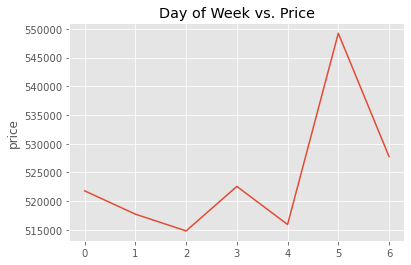

# Title

**Author**: Eric Hansen

## Overview


A simulation of advising a family in the Seattle area to sell their existing house and potentially buy a new house in the same region.
Data: King County Housing Data set
Methods: OSEMN; data cleaning, feature engineering, linear regression, iteration
Results: sqft_living, grade_squared, zipcode_avg, waterfront, View, day of week all have a significant impact on price
Recommendations: Actionable items:  
Strategically time home sale/purchase during the year and even within the week  
Examine locations/zipcodes carefully.  In the future, could project zipcodes with desirable growth  
Improve grade/square footage of current home to increase its value  
Identify future homes for purchase where grade/square footage are not yet maximized  
Use linear regression or other model to investigate current / prospective home price points.  


## Business Problem


What characteristics of a house influence its price?  What of these are actionable and in what way?
How can we use linear regression model to identify which of these characteristics has greatest impact on price?

## Data


The data is the King County Housing data set.  Each row represents a home sale that occurred during some months in 2014-2015.
The target variable is price.

# Column Names and descriptions for King County Data Set
* **id** - unique identified for a house
* **dateDate** - house was sold
* **pricePrice** -  is prediction target
* **bedroomsNumber** -  of Bedrooms/House
* **bathroomsNumber** -  of bathrooms/bedrooms
* **sqft_livingsquare** -  footage of the home
* **sqft_lotsquare** -  footage of the lot
* **floorsTotal** -  floors (levels) in house
* **waterfront** - House which has a view to a waterfront
* **view** - Has been viewed
* **condition** - How good the condition is ( Overall )
* **grade** - overall grade given to the housing unit, based on King County grading system
* **sqft_above** - square footage of house apart from basement
* **sqft_basement** - square footage of the basement
* **yr_built** - Built Year
* **yr_renovated** - Year when house was renovated
* **zipcode** - zip
* **lat** - Latitude coordinate
* **long** - Longitude coordinate
* **sqft_living15** - The square footage of interior housing living space for the nearest 15 neighbors
* **sqft_lot15** - The square footage of the land lots of the nearest 15 neighbors

## Methods

I did some data cleaning to remove invalid entries and irrelevant columns.  I engineered some features (e.g. grade_squared, month, day_of_week) to represent trends in predictor-response or to model something that was missing.  
I set up a model-creation function for quick iteration.  I ran this model on different combinations of numeric/categorical variables, and different transformations on the numeric columns.  I used train/test split and cross validation to ensure I didn't overtrain.
I used Variance Inflation Factor analysis to identify and remove features with multicollinearity.  
I tried Recursive Feature Elimination to see if this would help pare down the model, but it didn't do any better than just judicious EDA.

In order to justify using linear regression, I examined linear relationship between predictors and response variable.  
I checked a qq-plot of residuals to investigate normality of residuals.  
I inspected distribution of residuals by each predictor for presence of heteroscedasticity, and used the Lagrange Multiplier Heteroscedasticity Test by Breusch-Pagan. 

## Results

Day of week, month, square footage, grade, waterfront proximity, view, and zip code are impactful features on Price.


### Day Of Week vs. Price


### Month vs. Price


### Grade vs. Price


### Price by location


### Square Footage vs. Price


### View vs. Price


### Waterfront vs. Price


## Conclusions

Linear regression model has identified some characteristics to dial in on.  
Actionable items:
- Strategically time home sale/purchase during the year and even within the week
- Examine locations/zipcodes carefully.  In the future, could project zipcodes with desirable growth
- Improve grade/square footage of current home to increase its value
- Identify future homes for purchase where grade/square footage are not yet maximized
- Use linear regression or other model to investigate current / prospective home price points. 

## For More Information

Please review our full analysis in [our Jupyter Notebook](./dsc-phase1-project-template.ipynb) or our [presentation](./DS_Project_Presentation.pdf).

For any additional questions, please contact **name & email, name & email**

## Repository Structure

Describe the structure of your repository and its contents, for example:

```
├── __init__.py                         <- .py file that signals to python these folders contain packages
├── README.md                           <- The top-level README for reviewers of this project
├── student.ipynb   <- Narrative documentation of analysis in Jupyter notebook
├── DS_Project_Presentation.pdf         <- PDF version of project presentation
          <- Notebook containing data exploration
├── data                                <- Both sourced externally and generated from code
└── images                              <- Both sourced externally and generated from code
```